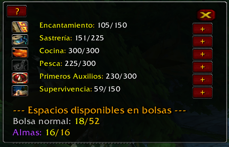
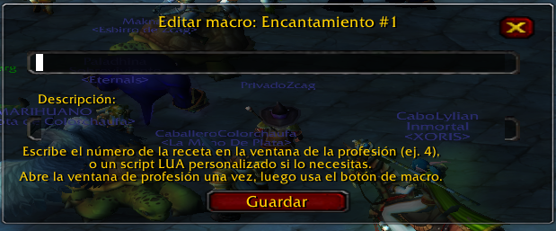

# SkillTracker para Turtle-Wow
(Optimizado para español, falta traducción al inglés)

**SkillTracker** es un addon para World of Warcraft 1.12 (Classic) que te permite visualizar tus habilidades y profesiones, gestionar macros rápidos para crafteo y lanzar hechizos, y monitorear el espacio disponible en tus bolsas, todo en una interfaz amigable y movible.

---

## Características

- **Visualiza tus profesiones y habilidades** con su progreso y acceso rápido.
- **Crea y ejecuta accesos rapidos a tus crafteos y hechizos** para cada profesión (por ejemplo, para craftear ítems específicos de un solo clic).
- **Edita, describe y elimina macros fácilmente** (con atajos intuitivos).
- **Verifica espacios libres en tus bolsas** agrupados por tipo (bolsa normal, de almas, de hierbas, de minería, etc).
- **Ventana totalmente movible y redimensionable** Se mueve haciendo clic izquierdo y arrastrando la ventana, para redimensionarla haciendo clic izquierdo y arrastrando la esquina inferior derecha.
- **Mini-botón en el minimapa** para mostrar/ocultar la ventana.
- **Modo solo profesiones o todas las habilidades** haciendo clic derecho en el marco principal.

---

## Instalación

1. **Descarga** o clona el repositorio en tu equipo.
2. **Copia la carpeta `SkillTracker`** en el directorio `Interface/AddOns/` de tu instalación de WoW 1.12.
3. **Reinicia el juego** o usa `/reload` si ya estás dentro.
4. Escribe el comando `/skilltracker` en el chat para abrir la ventana por primera vez.

---

## Uso Básico

- **Abrir/Cerrar ventana:**  
  - Usa el botón en el minimapa o el comando `/skilltracker`.

- **Agregar macro:**  
  - Haz clic en el botón `+` junto a la profesión.
  - Ingresa el número de receta (índice) o un script personalizado.
  - Opcional: escribe una descripción y selecciona un icono para identificar el macro.
  - Haz clic en **Guardar**.

- **Ejecutar macro:**  
  - Haz clic izquierdo sobre el botón del macro.  
    (El addon abrirá la ventana de profesión y realizará la acción automáticamente.)

- **Editar macro:**  
  - Haz clic derecho sobre el botón del macro.

- **Eliminar macro:**  
  - Shift + clic derecho sobre el botón del macro (te pedirá confirmación).

- **Ver espacio de bolsas:**  
  - La parte inferior de la ventana muestra los espacios libres y totales por cada tipo de bolsa equipada.

- **Ayuda rápida:**  
  - Haz clic en el botón `?` dentro de la ventana principal para ver un resumen de los atajos y funciones.

---

## Atajos y Combinaciones

- **Ejecutar macro:**  
  `Click izquierdo en botón macro` — Ejecuta la acción guardada (craftea o lanza).

- **Editar macro:**  
  `Click derecho en botón macro` — Edita el macro guardado.

- **Eliminar macro:**  
  `Shift + click derecho en botón macro` — Elimina el macro (con confirmación).

- **Cambiar entre solo profesiones/todas las habilidades:**  
  `Clic derecho en el marco principal` — Alterna el modo.

---

## Personalización

- **Soporte para más profesiones y bolsas:**  
  - La detección de bolsas soporta tipos estándar (almas, hierbas, encantamiento, etc).

---

## Compatibilidad

- **Diseñado para Turtle-Wow (World of Warcraft 1.12.x (Classic/Vanilla)**)
- **No requiere dependencias externas.**
- **No compatible con versiones superiores.**

---

## Capturas de Pantalla

---

## Créditos y Licencia

Addon desarrollado por zcagstudios.

Licencia: MIT  
Puedes modificar y compartir este addon libremente, mencionando al autor original.

---

## Preguntas o soporte

Para sugerencias o reportar bugs, puedes abrir un *issue* en este repositorio o contactar al autor.
